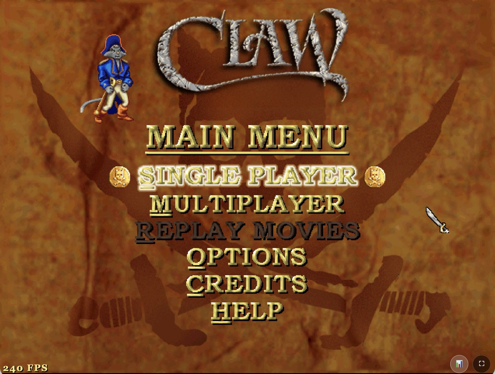
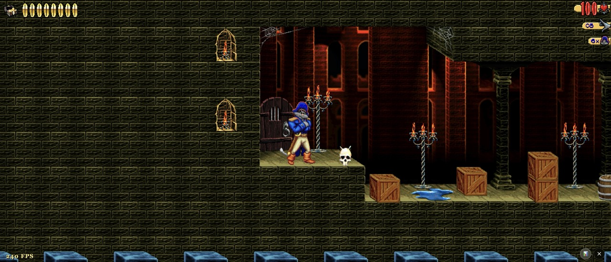

# OpenClaw WASM

> Play Captain Claw (1997) in your web browser - no installation needed!

**Play [here](https://arthurboss.github.io/WASM-OpenClaw/)** (requires you to upload the CLAW.REZ file)

Browser-based version of the classic platformer. Based on [OpenClaw](https://github.com/pjasicek/OpenClaw) by pjasicek.

| Main Menu | Level 1 Gameplay (in ultra widescreen) |
|-----------|------------------|
|  |  |

- Supports wide, ultra, and super widescreen resolutions
- Supports gamepad with vibration/rumble
- Supports save game progress

## Quick Start

### Requirements

- **Browser:** Chrome 105+ / Firefox 121+ / Safari 16.4+ / Edge 105+
- **Storage:** ~120MB free space in browser
- **CLAW.REZ:** Original game assets from Captain Claw (1997) — you must own the game

### Running the Game

1. **Open Terminal:**
   - **Mac:** Press `Cmd + Space`, type "Terminal", press Enter
   - **Windows:** Press `Win + R`, type "wsl", press Enter (requires WSL installed)
   - **Linux:** Press `Ctrl + Alt + T`

2. **Navigate to the game folder:**

   ```bash
   cd path/to/OpenClaw
   ```

   Replace `path/to/OpenClaw` with the actual location where you downloaded the game.

3. **Start the dev server:**

   ```bash
   npm run dev
   ```

4. **On your local machine, start an SSH tunnel:**

   ```bash
   ssh -o ControlPath=none -f -N -L 5173:localhost:5173 -i ~/.ssh/id_fedora_vm testuser@172.16.25.133
   ```

5. **Open in your web browser:**

   Visit: `http://localhost:5173/`

5. **First time only:** Upload your CLAW.REZ file when prompted

6. **Play!** The game loads in 2-3 seconds

## Controls

### Keyboard

| Action | Keys |
|--------|------|
| Move | Arrow keys or WASD |
| Jump | Space |
| Attack (Sword) | Left Ctrl |
| Fire (Ranged) | Left Alt |
| Change Weapon | Left Shift or E |
| Pause | Escape |

The game captures keyboard input to prevent browser and OS shortcuts (like Ctrl+C, Alt+Tab) from interfering with gameplay. ESC is also captured in fullscreen mode (Chrome/Edge only).

**macOS Note:** Ctrl + Arrow keys trigger Spaces navigation at the system level and cannot be blocked by the browser. To disable: System Settings → Keyboard → Keyboard Shortcuts → Mission Control → uncheck "Move left/right a space".

### Gamepad

Xbox, PlayStation, and most standard controllers supported. See [Gamepad Support](docs/player/GAMEPAD.md) for button mapping and vibration feedback.

## Features

- **Fast Loading:** 48MB download, levels load as you play
- **One-Time Setup:** Upload CLAW.REZ once, play forever
- **Full Game:** All 14 levels with original graphics and audio
- **Gamepad Support:** Controller input with vibration feedback
- **Save System:** Progress saved in browser storage

## Troubleshooting

Having issues? See [Troubleshooting Guide](docs/player/TROUBLESHOOTING.md).

## For Developers

See [docs/developer/](docs/developer/) for technical documentation:

- [Building](docs/developer/BUILDING.md) - Compiling from source
- [Architecture](docs/developer/ARCHITECTURE.md) - Lazy-loading and resource management

## License

GNU GPL v3 - See LICENSE file

Original game assets (CLAW.REZ) remain copyright Monolith Productions.

## Credits

- **Original Game:** Monolith Productions (1997)
- **OpenClaw Engine:** [pjasicek](https://github.com/pjasicek/OpenClaw)
- **WASM Port:** Arthur Boss

---

**Note:** This is a WASM-only fork optimized for browsers. For native desktop builds, visit the [original OpenClaw repository](https://github.com/pjasicek/OpenClaw).
