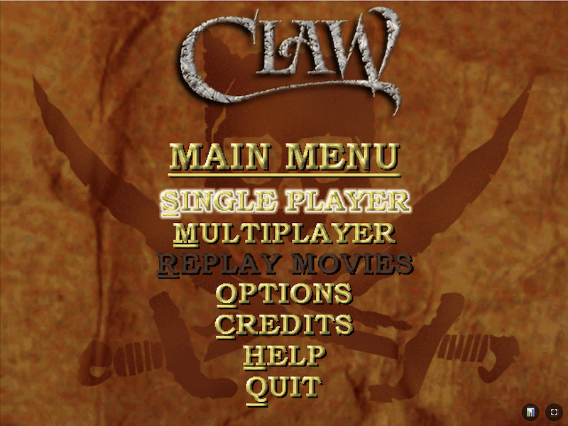
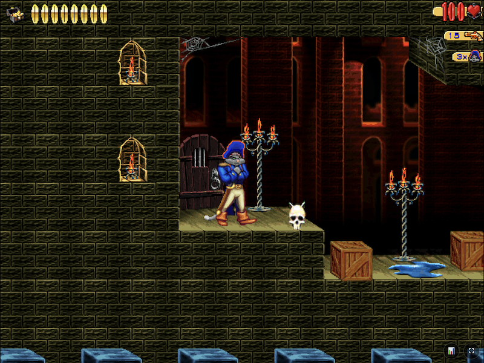

# OpenClaw WASM

> Play Captain Claw (1997) in your web browser - no installation needed!

Browser-based version of the classic platformer. Based on [OpenClaw](https://github.com/pjasicek/OpenClaw) by pjasicek.

| Main Menu | Level 1 Gameplay |
|-----------|------------------|
|  |  |

## 🎮 Quick Start

### Requirements

You'll need **CLAW.REZ** from the original Captain Claw (1997) game.

- The game will ask you to upload this file on first run
- It's saved in your browser - you only upload once
- **Legal:** You must own the original game to use its assets

### How to Play

1. **Start a local server by running the following in your computer's Terminal application** (pick one):

   ```bash
   # Recommended: HTTP/3 server (faster)
   ./scripts/start_http3_server.sh

   # Alternative: Python server
   cd Build_Release
   python3 -m http.server 8080
   ```

2. **Open in browser:**
   - HTTP/3: <https://localhost:8080/openclaw.html>
   - Python: <http://localhost:8080/openclaw.html>

3. **First time only:** Upload your CLAW.REZ file when prompted

4. **Play!** The game loads in 2-3 seconds

### Browser Requirements

- Chrome 105+ / Firefox 121+ / Safari 16.4+ / Edge 105+
- ~160MB free storage (for cached game files)

## 💡 Features

- **Fast Loading:** Only 48MB download, levels load as you play
- **One-Time Setup:** Upload CLAW.REZ once, play forever
- **Full Game:** All 14 levels, original graphics and audio
- **Modern Browsers:** Hardware-accelerated WebGL rendering
- **No Installation:** Runs entirely in your browser

## 🛠️ For Developers

### Building from Source

See [BUILDING.md](docs/BUILDING.md) for:

- How to compile the WASM build
- Prerequisites and build tools
- Development workflow
- When to rebuild vs refresh

### Architecture

See [ARCHITECTURE.md](docs/ARCHITECTURE.md) for:

- Lazy loading system design
- Resource management strategy
- Performance optimizations
- Code structure

### Contributing

Pull requests welcome for:

- Browser compatibility improvements
- Performance optimizations
- Bug fixes
- Documentation

## 🐛 Troubleshooting

Having issues? See [TROUBLESHOOTING.md](docs/TROUBLESHOOTING.md) for:

- How to clear cached files and re-upload CLAW.REZ
- Common error messages and solutions
- Browser-specific problems
- Performance tips

## 📋 Documentation

- **[SETUP.md](docs/SETUP.md)** - Detailed setup instructions
- **[BUILDING.md](docs/BUILDING.md)** - Build from source guide
- **[ARCHITECTURE.md](docs/ARCHITECTURE.md)** - Technical architecture
- **[TROUBLESHOOTING.md](docs/TROUBLESHOOTING.md)** - Common issues and fixes

## 📝 License

GNU GPL v3 - See LICENSE file

Original game assets (CLAW.REZ) remain copyright Monolith Productions.

## 🙏 Credits

- **Original Game:** Monolith Productions (1997)
- **OpenClaw Engine:** [pjasicek](https://github.com/pjasicek/OpenClaw)
- **WASM port fix and modernisation:** Arthur Boss

---

**Note:** This is a WASM-only fork optimized for browsers. For native desktop builds, visit the [original OpenClaw repository](https://github.com/pjasicek/OpenClaw).
